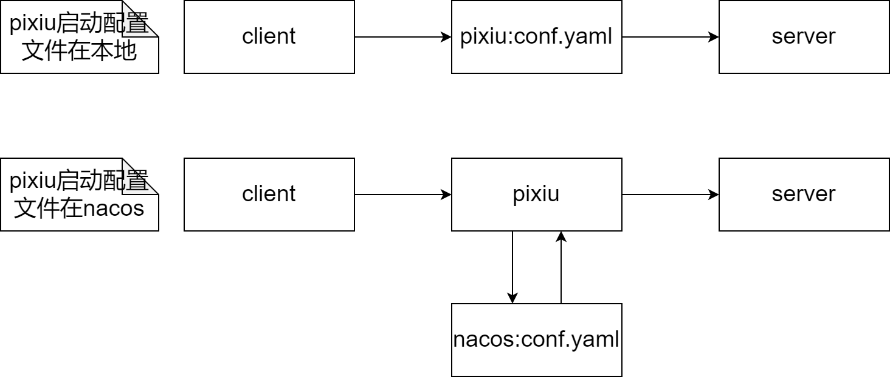

# **Dubbo-go-pixiu Samples: Nacos as a Remote Configuration Center**

## Introduction

This example demonstrates how to use Nacos as a remote configuration center for dubbo-go-pixiu.

The architecture, which uses Nacos as the remote configuration center, is shown in the diagram below:




## Steps to Run the Example:

1.  **Start ZooKeeper and Nacos in Docker**

    ```bash
    cd pathto/dubbo-go-pixiu-samples/dubbogo/simple/farconfnacos/docker
    docker-compose up
    ```

2.  **Configure Nacos as the Remote Configuration Center**

   - Open your browser and navigate to `http://172.22.142.171:8848/nacos/`. Initialize your login password and sign in.
   - Edit `client-config` part in `dubbogo/simple/farconfnacos/pixiu/conf.yaml`，make sure it matches the account and password you just initialized:
      ```yaml
      client-config:
       username: {your_username}
       password: {your_password}
      ```
   - Click on **Configuration Management \> Configurations \> Create Configuration** to add a new configuration. Set the `Data ID` to `dubbo-go-pixiu` and the `Group` to `DEFAULT_GROUP`. Copy the contents from the file `dubbogo/simple/farconfnacos/nacos/nacos.yaml` into the "Configuration Content" text area, then click **Publish**.

3.  **Set Command-Line Arguments and Start dubbo-go-pixiu**

    ```bash
    cd pathto/dubbo-go-pixiu
    go run cmd/pixiu/*.go gateway start -c pathto/dubbo-go-pixiu-samples/dubbogo/simple/farconfnacos/pixiu/conf.yaml
    ```

    Check the console output. If you see the following log entry, the remote configuration has been loaded successfully:

    ```
    2025-05-26T16:36:02.862+0800    INFO   config/config_load.go:137  http config:map[idle_timeout:123s read_timeout:456s write_timeout:789s] true
    ```